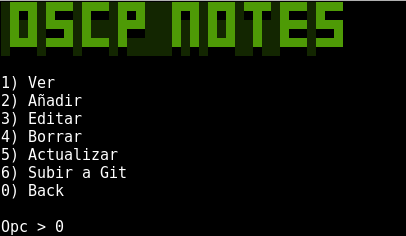
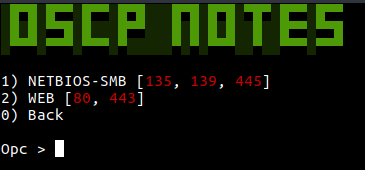
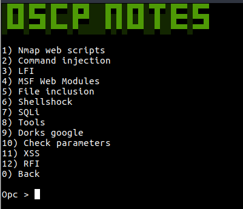
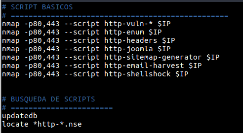

# OSCP - Notas

* Necesario hacer un fork o bajarse el código y subirlo cada uno a su Github, ya que si no, a la hora de actualizar o subir lo intentará hacer a mi cuenta y no os dejará sin saber la contraseña * 

Aplicación hecha en Python v2.7 para gestionar los apuntes usados en los laboratorios del OSCP.

No he incluido mis apuntes, porque considero muy necesario que cada uno se haga sus propios cheatsheets a la vez que va aprendiendo y poniendo en práctica los conocimientos adquiridos. A parte de que cada persona le gustaría tenerlos organizados de una forma.

Incluyo dos módulos y una notas por cada uno, a modo de ejemplo muy básico de la estructura que se podría seguir.

## Instalación

``` 
  git clone https://github.com/hectorriesco/OSCP.git
  sudo ./install 
```

*Recomiendo que si se va a usar la aplicación con un usuario que no sea root se indique en la instalación cuando pregunte por el nombre de usuario para que cambie los permisos a la carpeta.*

## Aplicación notas

- Menu principal con las acciones básicas de Ver, Añadir, Editar y Borrar una nota o módulo, así como Actualizar y subir a Git los ultimos cambios realizados.



- Lista de modulos encontrados en la carpeta Notas



- Listado de notas disponibles dentro del módulo



- Nota impresa




## Nombre de módulos

- El módulo debe seguir el siguiente formato para que la aplicación funcione correctamente:

[NOMBRE-MODULO_PUERTO1_PUERTO2]

- Ejemplos:

NETBIOS-SMB_135_139_445

SSH_22


## Notas

- Formato nombre de notas

Nombre_nota_[Texto_En_Rojo].txt

- Ejemplo

Reverse_Shell_[NETCAT].txt

- Para poner un comentario y que aparezca la linea en azul, empezar el texto con un \#.
